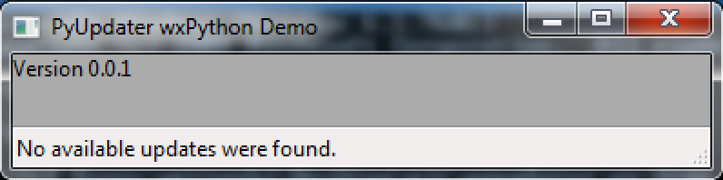
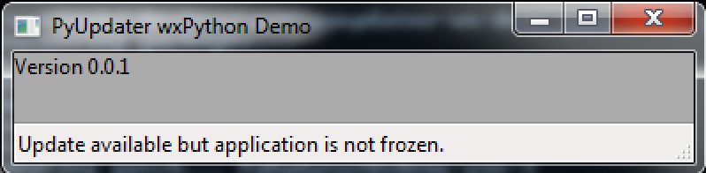
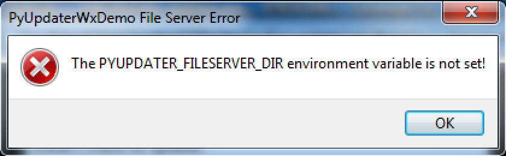
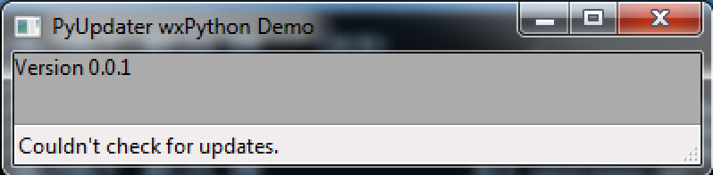
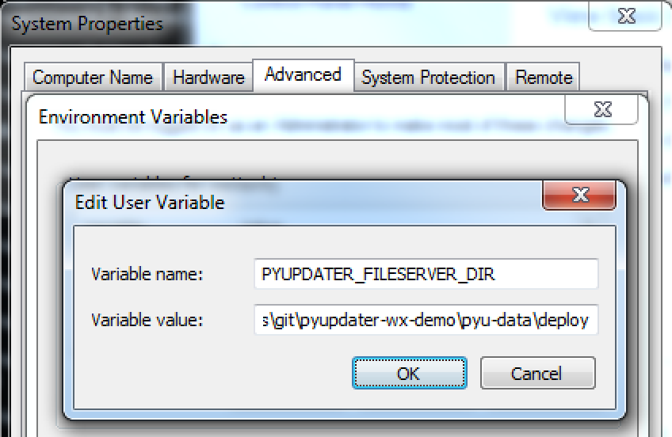

Demo of a Self-Updating wxPython Application
============================================

Running from Source
-------------------

The `pyupdater-wx-demo <https://github.com/wettenhj/pyupdater-wx-demo>`_ repository
provides a demo of a self-updating `wxPython <https://wxpython.org/>`_ application,
using `PyUpdater <http://www.pyupdater.org/>`_, which is built on top of
`PyInstaller <http://www.pyinstaller.org/>`_.

PyUpdater's command line interface is described here: http://www.pyupdater.org/usage-cli/

Let's try running pyupdater-wx-demo's run.py script:

.. code-block:: bash

    $ python run.py
    client_config.py is missing.
    You need to run: pyupdater init
    See: http://www.pyupdater.org/usage-cli/

After running :code:`pyupdater init` (described below), we can launch the
wxPython demo application:

.. code-block:: bash

    $ python run.py

In order to make update(s) available, we need to run :code:`pyupdater build`
and :code:`pyupdater pkg` (see http://www.pyupdater.org/usage-cli/), after
initializing a "keypack" (http://www.pyupdater.org/commands/#keys) which
is used to sign the updates.  Once the update(s) have been made available,
we can run the demo again:

.. code-block:: bash

    $ python run.py

If we are running :code:`python run.py`, rather than a frozen :code:`run.exe`
or :code:`PyUpdaterWxDemo.exe` binary, then PyUpdater cannot restart the
application when it finds a newer version available.

Initializing PyUpdater Configuration
------------------------------------

To build and sign frozen versions of the demo (:code:`PyUpdaterWxDemo.exe`
versions 0.0.1 and 0.0.2), we will use :code:`pyupdater build` and
:code:`pyupdater pkg`, but first we need to initialize the PyUpdater
configuration for our repository and create a "keypack" (for signing
packages) and import the keypack into our PyUpdater configuration.

We will run :code:`pyupdater init` from within the :code:`pyupdater-wx-demo/`
repository folder to initialize the PyUpdater configuration:

.. code-block:: bash

    $ pyupdater init
    Please enter app name
    [DEFAULT] -> PyUpdater App
    Press Enter To Use Default
    --> PyUpdaterWxDemo
    You entered PyUpdaterWxDemo, is this correct?
    [N/y]?y
    Please enter your company or name
    [DEFAULT] -> PyUpdater App
    Press Enter To Use Default
    --> Company Name
    You entered Company Name, is this correct?
    [N/y]?y
    Enter a url to ping for updates. - No Default Available
    --> http://www.example.com
    You entered http://www.example.com, is this correct?
    [N/y]?y
    Would you like to add another url for backup?
    [N/y]?n
    Would you like to enable patch updates?
    [Y/n]?y
    Please enter the path to where pyupdater will write the client\_config.py file. You'll need to import this file to initialize the update process. 
    Leave blank to use the current directory
    [DEFAULT] -> pyupdater-wx-demo
    Press Enter To Use Default
    --> 
    You entered pyupdater-wx-demo, is this correct?
    [N/y]?y

The :code:`pyupdater init` command creates :code:`client_config.py` and a
:code:`.pyupdater/config.pyu` JSON configuration file, and a :code:`pyu-data/`
folder, which will be used to store packages of the binary builds.
For this demo, the URL of our `Flask <http://flask.pocoo.org/>`_ file server
will vary depending on what port is available, so we just entered a
placeholder URL for now (http://www.example.com).

To create a keypack:

.. code-block:: bash

    $ pyupdater keys -c
    Are you sure you want to continue?
    [N/y]?y
    Please enter app name - No Default Available
    --> PyUpdaterWxDemo
    You entered PyUpdaterWxDemo, is this correct?
    [N/y]?y
    [INFO] Keypack placed in cwd

WARNING: The keypack contains a private key which should be kept SECRET!

The keypack is saved in JSON format and uses the .pyu extension (for PyUpdater).

To import the keypack into your PyUpdater configuration,

.. code-block:: bash

    $ pyupdater keys --import
    Are you sure you want to continue?
    [N/y]?y
    [INFO] Keypack import successfully
    [INFO] Saving Config
    [INFO] Config saved
    [INFO] Wrote client config

You should now DELETE the private keypack.pyu from your repository directory,
after saving it in a safe place.

Building standalone EXEs with PyUpdater
---------------------------------------

We can now build and sign frozen builds of the demo app.

To build v0.0.1,

.. code-block:: bash

    $ pyupdater build --console --hidden-import=SocketServer --app-version 0.0.1 run.py 
    ...
    [INFO] PyUpdaterWxDemo-win-0.0.1.zip has been placed in your new folder

The "new" folder is :code:`pyu-data/new/`.

PyUpdater is based on `PyInstaller <http://www.pyinstaller.org/>`_, so most of
the :code:`pyupdater` command line tools accept
`PyInstaller's command-line arguments <https://pythonhosted.org/PyInstaller/usage.html>`_
On Windows, we are using :code:`--console` (rather than :code:`--windowed`), so we can
access the frozen application's STDOUT / STDERR in a Command Prompt window.
On Mac OS X, :code:`--windowed` should be used to build an app bundle, to avoid wxPython's
:code:`This program needs access to the screen` error.

in addition to PyUpdater's command-line arguments.
The SocketServer module (used by werkzeug, which is used by Flask)
doesn't seem to get detected automatically by PyInstaller (observed
on Windows), so we added this as a hidden import when running :code:`pyupdater build`.

To package and sign v0.0.1,

.. code-block:: bash

    $ pyupdater pkg --process --sign
    [INFO] Adding package meta-data to version manifest
    [INFO] Moving packages to deploy folder
    [INFO] Processing packages complete
    [INFO] Signing packages...
    [INFO] Adding sig to update data
    [INFO] Created gzipped version manifest in deploy dir
    [INFO] Created gzipped key file in deploy dir
    [INFO] Signing packages complete

The signed :code:`PyUpdaterWxDemo-win-0.0.1.zip` package is now available in
your :code:`pyu-data/deploy/` folder.

Now let's build v0.0.2, so we can test the ability of the frozen demo
app to recognize that an update is available.

First, we need to increment the version in :code:`wxupdatedemo/__init__.py`
from :code:`__version__ = 0.0.1` to :code:`__version__ = 0.0.2`.

Now we can build and sign PyUpdaterWxDemo-win-0.0.2.zip as follows:

.. code-block:: bash

    $ pyupdater build --console --hidden-import=SocketServer --app-version 0.0.2 run.py 
    ...
    [INFO] PyUpdaterWxDemo-win-0.0.2.zip has been placed in your new folder

    $ pyupdater pkg --process --sign
    ...
    [INFO] Checking if patch creation is possible
    [INFO] Found source file to create patch
    [INFO] Starting patch creation
    [INFO] Creating patch... PyUpdaterWxDemo-win-2
    [INFO] Done creating patch... PyUpdaterWxDemo-win-2
    ...
    [INFO] Moving packages to deploy folder
    ...
    [INFO] Signing packages complete

The :code:`pyu-data/deploy/` folder now contains:

.. code-block:: bash

    14,139,797 PyUpdaterWxDemo-win-0.0.1.zip
    14,139,797 PyUpdaterWxDemo-win-0.0.2.zip
           191 PyUpdaterWxDemo-win-2
           180 keys.gz
           410 versions.gz

The :code:`PyUpdaterWxDemo-win-2` file (only 191 bytes in this case) is a patch
file, generated by :code:`pyupdater pkg --process --sign`, using the
:code:`bsdiff` Python module.

Running the v0.0.1 EXE with a Full Download Update Available
------------------------------------------------------------

If v0.0.1 of PyUpdaterWxDemo.exe detects that a new version (v0.0.2) is
available, it should be able to apply a patch, if it already has a signed
binary for v0.0.1 in the application's user data directory for the current
user.  In my case, the PyUpdaterWxDemo app's user data directory is
:code:`C:\Users\wettenhj\AppData\Local\Company Name\PyUpdaterWxDemo\update`,
reflecting the application name and company name I entered when running
:code:`pyupdater init`.  If a signed binary package is not available for
the current version (v0.0.1) in that user data directory, then the full
v0.0.2 binary package will be downloaded, as illustrated in this section.

Let's unzip :code:`PyUpdaterWxDemo-win-0.0.1.zip` and run the resulting
:code:`PyUpdaterWxDemo.exe`:

The error message about the missing fileserver directory environment variable
is specific to pyupdater-wx-demo.  In a real application, you would specify
the URL your application will receive updates from while running
:code:`pyupdater init` and it would be saved in client_config.py.  But for
this demo, we are running a local Flask file server to provide updates,
and it needs to know the location of the updates, which is
:code:`pyu-data/deploy/`.  An absolute path is required for the 
:code:`PYUPDATER_FILESERVER_DIR` environment variable.  For me it is:

:code:`C:\Users\wettenhj\git\pyupdater-wx-demo\pyu-data\deploy`

On Windows, you should launch a new Command Prompt window after saving the
environment variable shown above.

Now let's make a copy of :code:`pyu-data\deploy\PyUpdaterWxDemo-win-0.0.1.zip`,
extract it, and run it:

:code:`PyUpdaterWxDemo.exe --debug`

Because we built the EXE with PyInstaller's :code:`--console` argument, we
should be able to see some STDOUT/STDERR in a Command Prompt window:

.. code-block:: bash

     * Running on http://127.0.0.1:49451/ (Press CTRL+C to quit)
    127.0.0.1 - - [07/Jan/2017 16:40:45] "GET /fileserver-is-ready HTTP/1.1" 200 -
    DEBUG:pyupdater.client:Setting up directories...
    DEBUG:pyupdater.client:Downloading key file
    DEBUG:pyupdater.client.downloader:Url for request: http://127.0.0.1:49451/keys.gz
    127.0.0.1 - - [07/Jan/2017 16:40:45] "GET /keys.gz HTTP/1.1" 200 -
    DEBUG:pyupdater.client.downloader:Resource URL: http://127.0.0.1:49451/keys.gz
    DEBUG:pyupdater.client.downloader:Got content length of: 180
    DEBUG:pyupdater.client.downloader:Block size: 358
    DEBUG:pyupdater.client.downloader:{u'status': u'downloading', u'downloaded': 180, u'total': 180, u'percent_complete': u'100.0', u'time': u'--:--'}
    DEBUG:pyupdater.client.downloader:{u'status': u'finished', u'downloaded': 180, u'total': 180, u'percent_complete': u'100.0', u'time': u'00:00'}
    DEBUG:pyupdater.client.downloader:Download Complete
    DEBUG:pyupdater.client.downloader:No hash to verify
    DEBUG:pyupdater.client:Key file download successful
    DEBUG:pyupdater.client:Writing version file to disk
    DEBUG:pyupdater.client:Key file verified
    DEBUG:pyupdater.client:Loading version file...
    DEBUG:pyupdater.client:Downloading online version file
    DEBUG:pyupdater.client.downloader:Url for request: http://127.0.0.1:49451/versions.gz
    127.0.0.1 - - [07/Jan/2017 16:40:45] "GET /versions.gz HTTP/1.1" 200 -
    DEBUG:pyupdater.client.downloader:Resource URL: http://127.0.0.1:49451/versions.gz
    DEBUG:pyupdater.client.downloader:Got content length of: 412
    DEBUG:pyupdater.client.downloader:Block size: 822
    DEBUG:pyupdater.client.downloader:{u'status': u'downloading', u'downloaded': 412, u'total': 412, u'percent_complete': u'100.0', u'time': u'--:--'}
    DEBUG:pyupdater.client.downloader:{u'status': u'finished', u'downloaded': 412, u'total': 412, u'percent_complete': u'100.0', u'time': u'00:00'}
    DEBUG:pyupdater.client.downloader:Download Complete
    DEBUG:pyupdater.client.downloader:No hash to verify
    DEBUG:pyupdater.client:Version file download successful
    DEBUG:pyupdater.client:Writing version file to disk
    DEBUG:pyupdater.client:Data type: <type 'str'>
    DEBUG:pyupdater.client:Deleting signature from update data
    DEBUG:pyupdater.client:Version file verified
    DEBUG:pyupdater.client:Version Data: {u'latest': {u'PyUpdaterWxDemo': {u'stable': {u'win': u'0.0.2.2.0'}}}, u'updates ': {u'PyUpdaterWxDemo': {u'0.0.2.2.0': {u'win': {u'filename': u'PyUpdaterWxDemo- win-0.0.2.zip', u'file_hash': u'511af4793cff7eb34bd3cd0f71106c41fe860851fd7857e5 a5f85c391df246b7', u'patch_name': u'PyUpdaterWxDemo-win-2', u'file_size': 141398 75, u'patch_hash': u'0a7987712142aea59962fd6b16ab653860434f69f589cc362934e2dfa2d bec13', u'patch_size': 190}}, u'0.0.1.2.0': {u'win': {u'file_hash': u'c0324b8c03 15a710a0c1f0519073792bf886d6d67c15a5315e2d79a0fec84649', u'file_size': 14139875, u'filename': u'PyUpdaterWxDemo-win-0.0.1.zip'}}}}}
    DEBUG:pyupdater.client:Checking for PyUpdaterWxDemo updates...
    DEBUG:pyupdater.client.updates:Highest version: 0.0.2.2.0
    DEBUG:pyupdater.client:Current vesion: 0.0.1.2.0
    DEBUG:pyupdater.client:Latest version: 0.0.2.2.0
    DEBUG:pyupdater.client:Update Needed: True
    DEBUG:pyupdater.client.updates:Highest version: 0.0.2.2.0
    DEBUG:pyupdater.client.updates:Filename for PyUpdaterWxDemo-0.0.1.2.0: PyUpdaterWxDemo-win-0.0.1.zip
    DEBUG:pyupdater.client.updates:Filename for PyUpdaterWxDemo-0.0.2.2.0: PyUpdaterWxDemo-win-0.0.2.zip
    DEBUG:pyupdater.client.updates:Beginning removal of old updates
    DEBUG:pyupdater.package_handler.package:Filename: PyUpdaterWxDemo-win-0.0.1.zip
    DEBUG:pyupdater.package_handler.package:Directory: C:\Users\wettenhj\AppData\Local\Company Name\PyUpdaterWxDemo\update
    DEBUG:pyupdater.package_handler.package:C:\Users\wettenhj\AppData\Local\Company Name\PyUpdaterWxDemo\update\PyUpdaterWxDemo-win-0.0.1.zip does not exists
    DEBUG:pyupdater.package_handler.package:Not an archive format: None
    DEBUG:pyupdater.client.downloader:Hash for binary data: bc729b6585e16531952b8c5ef1353191605c13b7320b38064cea0c9a1bc307e0
    DEBUG:pyupdater.client.updates:Starting patch download
    DEBUG:pyupdater.client.updates:Starting patch update
    DEBUG:pyupdater.client.updates:PyUpdaterWxDemo-win-0.0.1.zip got deleted. No base binary to start patching form
    DEBUG:pyupdater.client.updates:Patch update failed
    DEBUG:pyupdater.client.updates:Starting full download
    DEBUG:pyupdater.client.updates:Starting full update
    DEBUG:pyupdater.client.updates:Downloading update...
    DEBUG:pyupdater.client.downloader:Url for request: http://127.0.0.1:49451/PyUpdaterWxDemo-win-0.0.2.zip
    127.0.0.1 - - [07/Jan/2017 16:40:45] "GET /PyUpdaterWxDemo-win-0.0.2.zip HTTP/1.  1" 200 -
    DEBUG:pyupdater.client.downloader:Resource URL: http://127.0.0.1:49451/PyUpdaterWxDemo-win-0.0.2.zip
    DEBUG:pyupdater.client.downloader:Got content length of: 14139875
    DEBUG:pyupdater.client.downloader:Block size: 32768
    DEBUG:pyupdater.client.downloader:{u'status': u'downloading', u'downloaded': 16385, u'total': 14139875, u'percent_complete': u'0.1', u'time': u'--:--'}
    DEBUG:pyupdater.client.downloader:Block size: 65536
    DEBUG:pyupdater.client.downloader:{u'status': u'downloading', u'downloaded': 49153, u'total': 14139875, u'percent_complete': u'0.3', u'time': u'--:--'}
    DEBUG:pyupdater.client.downloader:Block size: 131072
    DEBUG:pyupdater.client.downloader:{u'status': u'downloading', u'downloaded': 114689, u'total': 14139875, u'percent_complete': u'0.8', u'time': u'--:--'}
    DEBUG:pyupdater.client.downloader:Block size: 262144
    DEBUG:pyupdater.client.downloader:{u'status': u'downloading', u'downloaded': 245761, u'total': 14139875, u'percent_complete': u'1.7', u'time': u'--:--'}
    DEBUG:pyupdater.client.downloader:Block size: 524288
    DEBUG:pyupdater.client.downloader:{u'status': u'downloading', u'downloaded': 507905, u'total': 14139875, u'percent_complete': u'3.6', u'time': u'00:00'}
    DEBUG:pyupdater.client.downloader:Block size: 1048576
    DEBUG:pyupdater.client.downloader:{u'status': u'downloading', u'downloaded': 1032193, u'total': 14139875, u'percent_complete': u'7.3', u'time': u'00:00'}
    DEBUG:pyupdater.client.downloader:Block size: 2097152
    DEBUG:pyupdater.client.downloader:{u'status': u'downloading', u'downloaded': 2080769, u'total': 14139875, u'percent_complete': u'14.7', u'time': u'00:00'}
    DEBUG:pyupdater.client.downloader:Block size: 4194304
    DEBUG:pyupdater.client.downloader:{u'status': u'downloading', u'downloaded': 4177921, u'total': 14139875, u'percent_complete': u'29.5', u'time': u'00:00'}
    DEBUG:pyupdater.client.downloader:Block size: 4194304
    DEBUG:pyupdater.client.downloader:{u'status': u'downloading', u'downloaded': 8372225, u'total': 14139875, u'percent_complete': u'59.2', u'time': u'00:00'}
    DEBUG:pyupdater.client.downloader:Block size: 4194304
    DEBUG:pyupdater.client.downloader:{u'status': u'downloading', u'downloaded': 12566529, u'total': 14139875, u'percent_complete': u'88.9', u'time': u'00:00'}
    DEBUG:pyupdater.client.downloader:Block size: 3146692
    DEBUG:pyupdater.client.downloader:{u'status': u'downloading', u'downloaded': 14139875, u'total': 14139875, u'percent_complete': u'100.0', u'time': u'00:00'}
    DEBUG:pyupdater.client.downloader:{u'status': u'finished', u'downloaded': 14139875, u'total': 14139875, u'percent_complete': u'100.0', u'time': u'00:00'}
    DEBUG:pyupdater.client.downloader:Download Complete
    DEBUG:pyupdater.client.downloader:Checking file hash
    DEBUG:pyupdater.client.downloader:Update hash: 511af4793cff7eb34bd3cd0f71106c41fe860851fd7857e5a5f85c391df246b7
    DEBUG:pyupdater.client.downloader:Hash for binary data: 511af4793cff7eb34bd3cd0f71106c41fe860851fd7857e5a5f85c391df246b7
    DEBUG:pyupdater.client.downloader:File hash verified
    DEBUG:pyupdater.client.updates:Download Complete
    DEBUG:pyupdater.client.updates:Full download successful
    127.0.0.1 - - [07/Jan/2017 16:40:46] "POST /shutdown HTTP/1.1" 200 -
    Exiting with status: Extracting update and restarting.

PyUpdaterWxDemo.exe v0.0.1 should automatically exit and launch
PyUpdaterWxDemo.exe v0.0.2:

.. image:: images/updated_app_running_after_full_download.png
   :width: 50%

Again, because the EXE was built with :code:`--console`, we should be able
to see some STDOUT/STDERR:

.. code-block:: bash

     * Running on http://127.0.0.1:49458/ (Press CTRL+C to quit)
    127.0.0.1 - - [07/Jan/2017 16:41:04] "GET /fileserver-is-ready HTTP/1.1" 200 -
    127.0.0.1 - - [07/Jan/2017 16:41:04] "GET /keys.gz HTTP/1.1" 200 -
    127.0.0.1 - - [07/Jan/2017 16:41:04] "GET /versions.gz HTTP/1.1" 200 -

This time the application has retrieved :code:`versions.gz` from the file server
and concluded that there are no available updates, i.e. we are already running
the latest version.

Now let's run PyUpdaterWxDemo.exe (extracted from PyUpdaterWxDemo-win-0.0.1.zip)
again.  This time, it should launch more quickly, i.e. it won't need to
redownload the v0.0.2 update - it should already be available in the user data
directory - :code:`C:\Users\wettenhj\AppData\Local\Company Name\PyUpdaterWxDemo\update`.

.. image:: images/updated_app_running_after_full_download.png
   :width: 50%

Running the v0.0.2 EXE with a Patch Update Available
----------------------------------------------------
Now that we have a signed v0.0.2 package in our user data directory -
:code:`C:\Users\wettenhj\AppData\Local\Company Name\PyUpdaterWxDemo\update`,
if we create a v0.0.3, we should be able to upgrade to that version via
a patch, instead of downloading the full package.

First, we need to increment the version in :code:`wxupdatedemo/__init__.py`
from :code:`__version__ = 0.0.2` to :code:`__version__ = 0.0.3`.

Now we can build and sign as before:

.. code-block:: bash

    pyupdater build --console --hidden-import=SocketServer --app-version=0.0.3 run.py

    pyupdater pkg --process --sign

The :code:`pyu-data/deploy/` directory now contains:

.. code-block:: bash

           180 keys.gz
    14,139,797 PyUpdaterWxDemo-win-0.0.1.zip
    14,139,797 PyUpdaterWxDemo-win-0.0.2.zip
    14,139,797 PyUpdaterWxDemo-win-0.0.3.zip
           191 PyUpdaterWxDemo-win-2
           193 PyUpdaterWxDemo-win-3
           191 PyUpdaterWxDemo-win-4
           537 versions.gz

We can also find information in the :code:`.pyupdater/config.pyu` JSON file
about the latest available updates and patches.  Keep in mind that the 
version numbers in :code:`.pyupdater/config.pyu` use two extra digits,
e.g. :code:`0.0.3.2.0`, where the '2' means 'stable' (compared with '1'
for 'beta' and '0' for 'alpha'), and the final '0' is the release number.

Now let's run PyUpdaterWxDemo.exe (extracted from PyUpdaterWxDemo-win-0.0.1.zip)
again.  This time, it should be able to quickly apply the latest patch to upgrade
from v0.0.2 to v0.0.3, using the existing signed v0.0.2 package in the user
data directory (:code:`C:\Users\wettenhj\AppData\Local\Company Name\PyUpdaterWxDemo\update`)
and the patch file downloaded from the file server:

.. code-block:: bash

     * Running on http://127.0.0.1:49555/ (Press CTRL+C to quit)
    127.0.0.1 - - [07/Jan/2017 21:34:05] "GET /fileserver-is-ready HTTP/1.1" 200 -
    DEBUG:pyupdater.client:Setting up directories...
    DEBUG:pyupdater.client:Downloading key file
    DEBUG:pyupdater.client.downloader:Url for request: http://127.0.0.1:49555/keys.gz
    127.0.0.1 - - [07/Jan/2017 21:34:05] "GET /keys.gz HTTP/1.1" 200 -
    DEBUG:pyupdater.client.downloader:Resource URL: http://127.0.0.1:49555/keys.gz
    DEBUG:pyupdater.client.downloader:Got content length of: 180
    DEBUG:pyupdater.client.downloader:Block size: 358
    DEBUG:pyupdater.client.downloader:{u'status': u'downloading', u'downloaded': 180, u'total': 180, u'percent_complete': u'100.0', u'time': u'--:--'}
    DEBUG:pyupdater.client.downloader:{u'status': u'finished', u'downloaded': 180, u'total': 180, u'percent_complete': u'100.0', u'time': u'00:00'}
    DEBUG:pyupdater.client.downloader:Download Complete
    DEBUG:pyupdater.client.downloader:No hash to verify
    DEBUG:pyupdater.client:Key file download successful
    DEBUG:pyupdater.client:Writing version file to disk
    DEBUG:pyupdater.client:Key file verified
    DEBUG:pyupdater.client:Loading version file...
    DEBUG:pyupdater.client:Downloading online version file
    DEBUG:pyupdater.client.downloader:Url for request: http://127.0.0.1:49555/versions.gz
    127.0.0.1 - - [07/Jan/2017 21:34:05] "GET /versions.gz HTTP/1.1" 200 -
    DEBUG:pyupdater.client.downloader:Resource URL: http://127.0.0.1:49555/versions.gz
    DEBUG:pyupdater.client.downloader:Got content length of: 537
    DEBUG:pyupdater.client.downloader:Block size: 1072
    DEBUG:pyupdater.client.downloader:{u'status': u'downloading', u'downloaded': 537, u'total': 537, u'percent_complete': u'100.0', u'time': u'--:--'}
    DEBUG:pyupdater.client.downloader:{u'status': u'finished', u'downloaded': 537, u'total': 537, u'percent_complete': u'100.0', u'time': u'00:00'}
    DEBUG:pyupdater.client.downloader:Download Complete
    DEBUG:pyupdater.client.downloader:No hash to verify
    DEBUG:pyupdater.client:Version file download successful
    DEBUG:pyupdater.client:Writing version file to disk
    DEBUG:pyupdater.client:Data type: <type 'str'>
    DEBUG:pyupdater.client:Deleting signature from update data
    DEBUG:pyupdater.client:Version file verified
    DEBUG:pyupdater.client:Version Data: {u'latest': {u'PyUpdaterWxDemo': {u'stable': {u'win': u'0.0.3.2.0'}}}, u'updates': {u'PyUpdaterWxDemo': {u'0.0.3.2.0': {u'win': {u'filename': u'PyUpdaterWxDemo-win-0.0.3.zip', u'file_hash': u'3740f42b3b98d3fc22b4f7b504810e81a24388f5319746282ddc37dd01b1ed2d', u'patch_name': u'PyUpdaterWxDemo-win-4', u'file_size': 14139797, u'patch_hash': u'4d5c3a4d5bbafaead615132ecc3d6001d4cdc8ff09f056e8988fbcffb95cabab', u'patch_size': 191}}, u'0.0.2.2.0': {u'win': {u'filename': u'PyUpdaterWxDemo-win-0.0.2.zip', u'file_hash': u'0645d90c163ecb6fccff5007324ee7e8cdd01d7a9c25bedef00ec8d36c095839', u'patch_name': u'PyUpdaterWxDemo-win-2', u'file_size': 14139797, u'patch_hash': u'c471cfc10c73d76ae7cf4d87f94da15c1cc5d1365d66f4db046fe67bc635a13a', u'patch_size': 191}}, u'0.0.1.2.0': {u'win': {u'filename': u'PyUpdaterWxDemo-win-0.0.1.zip', u'file_hash': u'61106956b23f3ce8b7c1b485ed4ae34264c83ac202ac2843334308e56b49d487', u'patch_name': u'PyUpdaterWxDemo-win-3', u'file_size': 14139797, u'patch_hash': u'f09bef145040c02d7d5b9fe3c020b3d7610285b31bca321e6c4e52d2cdea0ba5', u'patch_size': 193}}}}}
    DEBUG:pyupdater.client:Checking for PyUpdaterWxDemo updates...
    DEBUG:pyupdater.client.updates:Highest version: 0.0.3.2.0
    DEBUG:pyupdater.client:Current vesion: 0.0.2.2.0
    DEBUG:pyupdater.client:Latest version: 0.0.3.2.0
    DEBUG:pyupdater.client:Update Needed: True
    DEBUG:pyupdater.client.updates:Highest version: 0.0.3.2.0
    DEBUG:pyupdater.client.updates:Filename for PyUpdaterWxDemo-0.0.2.2.0: PyUpdaterWxDemo-win-0.0.2.zip
    DEBUG:pyupdater.client.updates:Filename for PyUpdaterWxDemo-0.0.3.2.0: PyUpdaterWxDemo-win-0.0.3.zip
    DEBUG:pyupdater.client.updates:Beginning removal of old updates
    DEBUG:pyupdater.package_handler.package:Filename: PyUpdaterWxDemo-win-0.0.2.zip
    DEBUG:pyupdater.package_handler.package:Directory: C:\Users\wettenhj\AppData\Local\Company Name\PyUpdaterWxDemo\update
    DEBUG:pyupdater.package_handler.package:Extracting update archive info for: PyUpdaterWxDemo-win-0.0.2.zip
    DEBUG:pyupdater.package_handler.package:Got version info
    DEBUG:pyupdater.package_handler.package:Parsing "PyUpdaterWxDemo-win-0.0.2.zip" for platform info
    DEBUG:pyupdater.package_handler.package:Platform name is: win
    DEBUG:pyupdater.package_handler.package:Got platform info
    DEBUG:pyupdater.package_handler.package:Package name: PyUpdaterWxDemo-win-0.0.2.zip
    DEBUG:pyupdater.package_handler.package:Regex name: PyUpdaterWxDemo
    DEBUG:pyupdater.package_handler.package:Got name of update: PyUpdaterWxDemo
    DEBUG:pyupdater.package_handler.package:Info extraction complete
    DEBUG:pyupdater.package_handler.package:Current version: 0.0.2.2.0
    DEBUG:pyupdater.package_handler.package:Name to search for: PyUpdaterWxDemo
    DEBUG:pyupdater.package_handler.package:Checking: PyUpdaterWxDemo-win-0.0.2.zip
    DEBUG:pyupdater.package_handler.package:Found possible match
    DEBUG:pyupdater.package_handler.package:Latest name: PyUpdaterWxDemo
    DEBUG:pyupdater.package_handler.package:Old name: PyUpdaterWxDemo-win-0.0.2.zip
    DEBUG:pyupdater.package_handler.package:Found version: 0.0.2.2.0
    DEBUG:pyupdater.package_handler.package:Old version: 0.0.2.2.0
    DEBUG:pyupdater.package_handler.package:Current version: 0.0.2.2.0
    DEBUG:pyupdater.client.updates:File does not exist
    DEBUG:pyupdater.client.updates:Starting patch download
    DEBUG:pyupdater.client.updates:Starting patch update
    DEBUG:pyupdater.client.patcher:Current Info - Filename: PyUpdaterWxDemo-win-0.0.2.zip
    DEBUG:pyupdater.client.patcher:Current Info - File hash: 0645d90c163ecb6fccff5007324ee7e8cdd01d7a9c25bedef00ec8d36c095839
    DEBUG:pyupdater.client.patcher:Current Info - File size: 14139797
    DEBUG:pyupdater.client.patcher:Starting patch updater...
    DEBUG:pyupdater.client.patcher:Checking for current installed binary to patch
    DEBUG:pyupdater.client.patcher:Binary found and verified
    DEBUG:pyupdater.client.patcher:Getting patch meta-data
    DEBUG:pyupdater.client.patcher:Getting required patches
    DEBUG:pyupdater.client.patcher:Current Info - Filename: PyUpdaterWxDemo-win-0.0.3.zip
    DEBUG:pyupdater.client.patcher:Current Info - File hash: 3740f42b3b98d3fc22b4f7b504810e81a24388f5319746282ddc37dd01b1ed2d
    DEBUG:pyupdater.client.patcher:Current Info - File size: 14139797
    DEBUG:pyupdater.client.patcher:Downloading patches
    DEBUG:pyupdater.client.downloader:Url for request: http://127.0.0.1:49555/PyUpdaterWxDemo-win-4
    127.0.0.1 - - [07/Jan/2017 21:34:05] "GET /PyUpdaterWxDemo-win-4 HTTP/1.1" 200 -
    
    DEBUG:pyupdater.client.downloader:Resource URL: http://127.0.0.1:49555/PyUpdaterWxDemo-win-4
    DEBUG:pyupdater.client.downloader:Got content length of: 191
    DEBUG:pyupdater.client.downloader:Block size: 380
    DEBUG:pyupdater.client.downloader:{u'status': u'downloading', u'downloaded': 191, u'total': 191, u'percent_complete': u'100.0', u'time': u'--:--'}
    DEBUG:pyupdater.client.downloader:{u'status': u'finished', u'downloaded': 191, u'total': 191, u'percent_complete': u'100.0', u'time': u'00:00'}
    DEBUG:pyupdater.client.downloader:Download Complete
    DEBUG:pyupdater.client.downloader:Checking file hash
    DEBUG:pyupdater.client.downloader:Update hash: 4d5c3a4d5bbafaead615132ecc3d6001d4cdc8ff09f056e8988fbcffb95cabab
    DEBUG:pyupdater.client.downloader:Hash for binary data: 4d5c3a4d5bbafaead615132ecc3d6001d4cdc8ff09f056e8988fbcffb95cabab
    DEBUG:pyupdater.client.downloader:File hash verified
    DEBUG:pyupdater.client.patcher:Applying patches
    DEBUG:pyupdater.client.patcher:Applied patch successfully
    DEBUG:pyupdater.client.patcher:Writing update to disk
    DEBUG:pyupdater.client.patcher:Wrote update file
    DEBUG:pyupdater.client.patcher:Current Info - Filename: PyUpdaterWxDemo-win-0.0.3.zip
    DEBUG:pyupdater.client.patcher:Current Info - File hash: 3740f42b3b98d3fc22b4f7b504810e81a24388f5319746282ddc37dd01b1ed2d
    DEBUG:pyupdater.client.patcher:Current Info - File size: 14139797
    DEBUG:pyupdater.client.patcher:checking file hash match
    DEBUG:pyupdater.client.updates:Patch download successful
    127.0.0.1 - - [07/Jan/2017 21:34:05] "POST /shutdown HTTP/1.1" 200 -
    DEBUG:__main__:Extracting update and restarting...
    
.. code-block:: bash

     * Running on http://127.0.0.1:49486/ (Press CTRL+C to quit)
    127.0.0.1 - - [07/Jan/2017 17:36:05] "GET /fileserver-is-ready HTTP/1.1" 200 -
    127.0.0.1 - - [07/Jan/2017 17:36:05] "GET /keys.gz HTTP/1.1" 200 -
    127.0.0.1 - - [07/Jan/2017 17:36:05] "GET /versions.gz HTTP/1.1" 200 -

.. image:: images/running_after_patch_update.png
   :width: 50%

Version Number Semantics
~~~~~~~~~~~~~~~~~~~~~~~~

For a version like 1.3.5, '1' is the major version, '3' is the minor version
and '5' is the patch version.  When using PyUpdater, you will sometimes see
two additional numbers at the end of the version string, e.g. "1.3.5.2.0".
The '2' is used to indicate a stable release (compared with '1' for a beta
release and '0' for an alpha release), and the final '0' is the release number.

For updates which only change the patch version (e.g. from 1.3.5 to 1.3.7), an
application configured to use the PyUpdater client can automatically download
the new binary and restart itself.

Tests
~~~~~
Tests can be run with:

.. code-block:: bash

    python setup.py nosetests

Troubleshooting
~~~~~~~~~~~~~~~
1. If PyInstaller hangs while performing the operation:

.. code-block:: bash

    Adding redirect Microsoft.VC90.MFC

See: http://stackoverflow.com/questions/40380721/pyinstaller-hangs-adding-redirect-microsoft-vc90-mfc

This issue has been observed on Windows with PyInstaller 3.2

2. In some versions of PyInstaller, sys.exit (used by run.py's
DisplayVersionAndExit) can generate a misleading 'Failed to execute script run'
message when running the frozen app.  This message can usually be ignored:
https://github.com/pyinstaller/pyinstaller/issues/1869

3. One of the tests may fail on Windows if running without administrator
privileges, because PyInstaller doesn't seem to embed an appropriate manifest
into the EXE to tell the OS that privilege elevation is not required.

4. On Mac OS X, if the GUI resolution looks too low, you may wish to edit the
SPEC file used by PyInstaller / PyUpdater, in particular, you may want to add
NSHighResolutionCapable to the Info.plist as described here: 
https://pythonhosted.org/PyInstaller/spec-files.html
Using SPEC files with PyUpdater is described here: http://www.pyupdater.org/usage-cli/#step-6-make-spec

5. On Mac OS X, if you get wxPython's :code:`This program needs access to the screen`
error, you need to run :code:`pyupdater build` with :code:`--windowed` instead of
:code:`--console` to create an app bundle.  You can still access the application's
STDOUT / STDERR in your Terminal window by running the binary inside the app bundle,
i.e. :code:`./PyUpdaterWxDemo.app/Contents/MacOS/PyUpdaterWxDemo --debug`.
